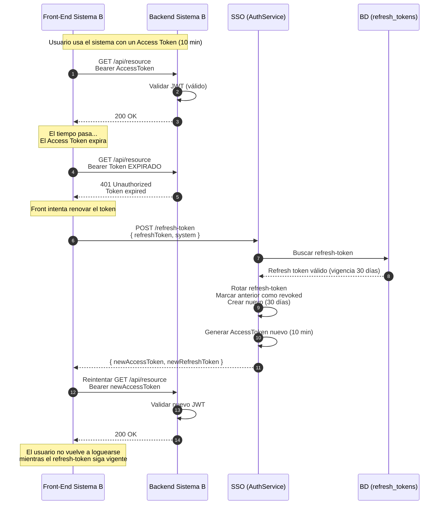

Diagrama de secuencia
Fase B - Refresh-token

```mermaid
sequenceDiagram
    autonumber

    participant Front as Front-End Sistema B
    participant BackB as Backend Sistema B
    participant SSO as SSO (AuthService)
    participant DB as BD (refresh_tokens)

    Note over Front,BackB: Usuario usa el sistema con un Access Token (10 min)

    Front->>BackB: GET /api/resource<br>Bearer AccessToken
    BackB->>BackB: Validar JWT (válido)
    BackB-->>Front: 200 OK

    Note over Front: El tiempo pasa...<br>El Access Token expira

    Front->>BackB: GET /api/resource<br>Bearer Token EXPIRADO
    BackB-->>Front: 401 Unauthorized<br>Token expired

    Note over Front: Front intenta renovar el token

    Front->>SSO: POST /refresh-token<br>{ refreshToken, system }
    SSO->>DB: Buscar refresh-token
    DB-->>SSO: Refresh token válido (vigencia 30 días)

    SSO->>SSO: Rotar refresh-token<br>Marcar anterior como revoked<br>Crear nuevo (30 días)
    SSO->>SSO: Generar AccessToken nuevo (10 min)

    SSO-->>Front: { newAccessToken, newRefreshToken }

    Front->>BackB: Reintentar GET /api/resource<br>Bearer newAccessToken
    BackB->>BackB: Validar nuevo JWT
    BackB-->>Front: 200 OK

    Note over Front: El usuario no vuelve a loguearse<br>mientras el refresh-token siga vigente
```