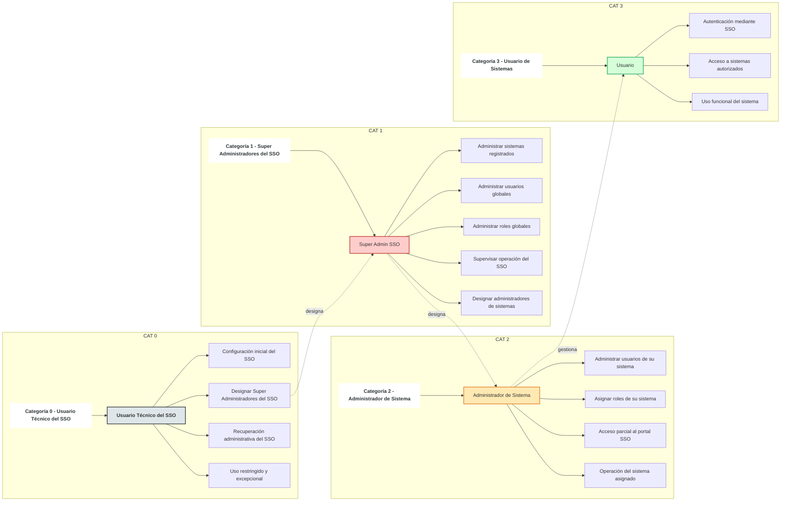
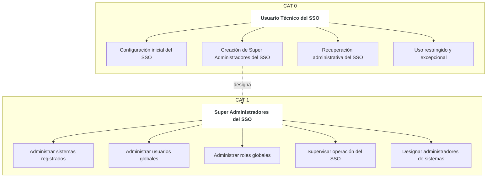
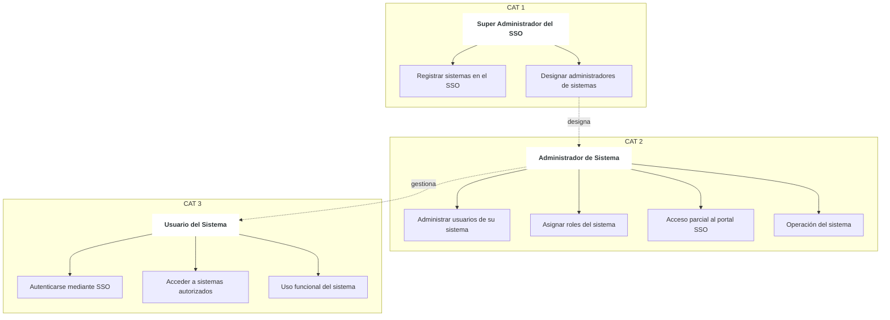
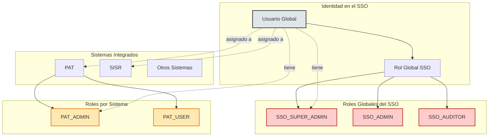

# Modelo de Gobernanza, Roles y Accesos del Sistema de Autenticación Única (SSO)

El presente apartado describe el modelo de gobernanza, administración de roles y control de accesos del Sistema de Autenticación Única (SSO), así como su relación con los sistemas integrados.  
La explicación se apoya en tres diagramas conceptuales elaborados en lenguaje Mermaid (`.mmd`), los cuales permiten comprender de manera progresiva el funcionamiento del SSO desde su arranque hasta la operación diaria.

## Diagrama completo

---

## 1. Gobernanza y Arranque del Sistema de Autenticación Única

**Referencia:** *Diagrama 1 – Gobernanza del SSO (Arranque y Administración)*

El primer diagrama describe el proceso de **arranque institucional del SSO** y los roles responsables de su administración a nivel global.

### Usuario Técnico del SSO (Categoría 0)

El Usuario Técnico del SSO es una cuenta especial, no asociada a una persona natural, cuya finalidad es:

- Realizar la configuración inicial del SSO.
- Crear y designar a los Super Administradores del SSO.
- Permitir la recuperación administrativa del sistema ante contingencias.
- Garantizar la continuidad operativa del SSO.

Este usuario tiene un **uso restringido y excepcional**, y no forma parte de la operación cotidiana del sistema.

### Super Administradores del SSO (Categoría 1)

Los Super Administradores del SSO representan a **personas naturales debidamente identificadas**, responsables de la administración integral del SSO una vez que el sistema se encuentra operativo.

Entre sus funciones principales se encuentran:

- Administrar los sistemas registrados en el SSO.
- Gestionar usuarios globales.
- Gestionar roles globales.
- Supervisar la operación general del SSO.
- Designar a los administradores de los sistemas integrados.

El diagrama enfatiza que el Usuario Técnico **designa** a los Super Administradores del SSO, sin implicar que se trate de la misma persona.

---

## 2. Administración y Uso de los Sistemas Integrados

**Referencia:** *Diagrama 2 – Administración y Uso de los Sistemas Integrados*

El segundo diagrama explica cómo el SSO se relaciona con los sistemas integrados (como PAT, SISR u otros), una vez que la plataforma ya se encuentra en funcionamiento.

### Administrador de Sistema (Categoría 2)

El Administrador de Sistema es un usuario responsable de la gestión de un sistema específico integrado al SSO.  
Sus funciones incluyen:

- Administrar usuarios de su propio sistema.
- Asignar roles definidos por dicho sistema.
- Acceder al portal del SSO con permisos parciales.
- Supervisar la operación funcional del sistema bajo su responsabilidad.

Este rol es **designado por un Super Administrador del SSO**, lo cual representa una relación de delegación administrativa, no de jerarquía personal.

### Usuario del Sistema (Categoría 3)

El Usuario del Sistema es el usuario final que consume los servicios de uno o más sistemas integrados.

Sus capacidades se limitan a:

- Autenticarse mediante el SSO.
- Acceder únicamente a los sistemas para los cuales ha sido autorizado.
- Utilizar las funcionalidades propias del sistema según los roles asignados.

El diagrama deja explícito que el Administrador de Sistema **gestiona** usuarios, pero no implica que una misma persona deba cumplir ambos roles.

---

## 3. Separación entre Roles Globales y Roles por Sistema

**Referencia:** *Diagrama 3 – Separación de Roles Globales y Roles por Sistema*

El tercer diagrama clarifica uno de los principios fundamentales del modelo: la **separación de responsabilidades entre el SSO y los sistemas integrados**.

### Usuario Global

El Usuario Global representa la identidad única registrada en el SSO.  
Esta identidad:

- Existe una sola vez en la plataforma.
- Puede ser asignada a uno o más sistemas.
- Puede tener roles globales y roles por sistema de forma independiente.

### Roles Globales del SSO

Los Roles Globales controlan las capacidades del usuario **dentro del SSO**, tales como:

- Administración del SSO.
- Auditoría.
- Gestión de usuarios y sistemas.

Ejemplos de roles globales:
- `SSO_SUPER_ADMIN`
- `SSO_ADMIN`
- `SSO_AUDITOR`

Estos roles **no otorgan permisos funcionales dentro de los sistemas integrados**.

### Roles por Sistema

Cada sistema integrado define y administra sus propios roles, los cuales regulan las funcionalidades internas del sistema.

Ejemplos:
- `PAT_ADMIN`
- `PAT_USER`

El SSO no interpreta ni gobierna estos roles; únicamente los transporta como parte del contexto de autenticación.

---

## 4. Principio Rector del Modelo

> El Sistema de Autenticación Única es responsable de la gestión de identidades y roles globales, mientras que los sistemas integrados son responsables de la definición y aplicación de sus roles funcionales.

Este principio garantiza:

- Separación clara de responsabilidades.
- Escalabilidad del ecosistema de sistemas.
- Facilidad de auditoría.
- Continuidad institucional ante cambios de personal.

---
## 5. Diagrama consolidado

## 6. Consideraciones Finales

El uso de los tres diagramas permite una comprensión progresiva del modelo:

1. **Diagrama 1:** explica quién gobierna el SSO y cómo se inicia.
2. **Diagrama 2:** muestra cómo se administran y utilizan los sistemas integrados.
3. **Diagrama 3:** delimita claramente los roles globales y los roles por sistema.
4. 

Este enfoque modular facilita la inclusión del modelo en documentos normativos, manuales técnicos y procesos de auditoría institucional.

